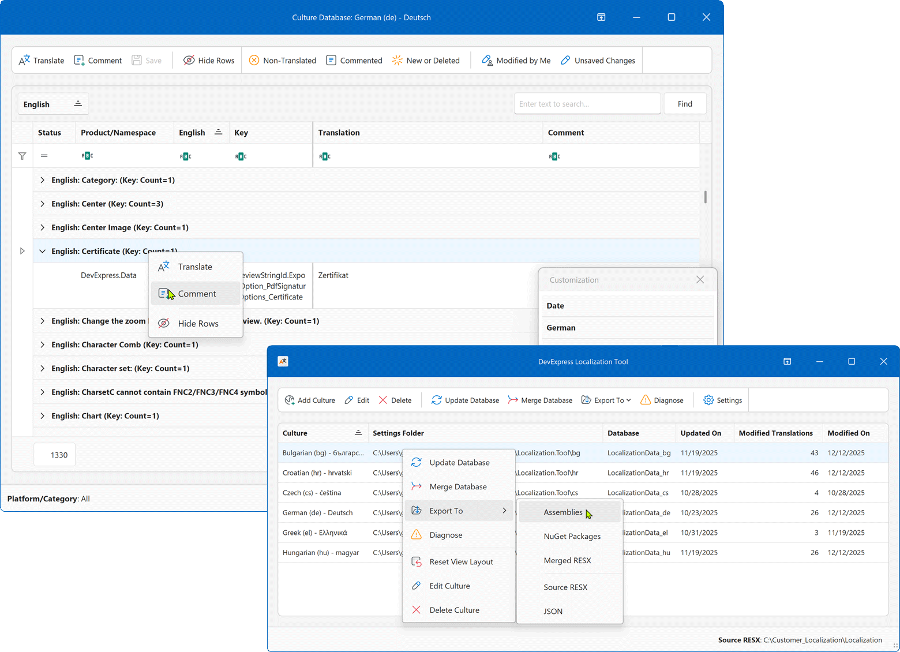
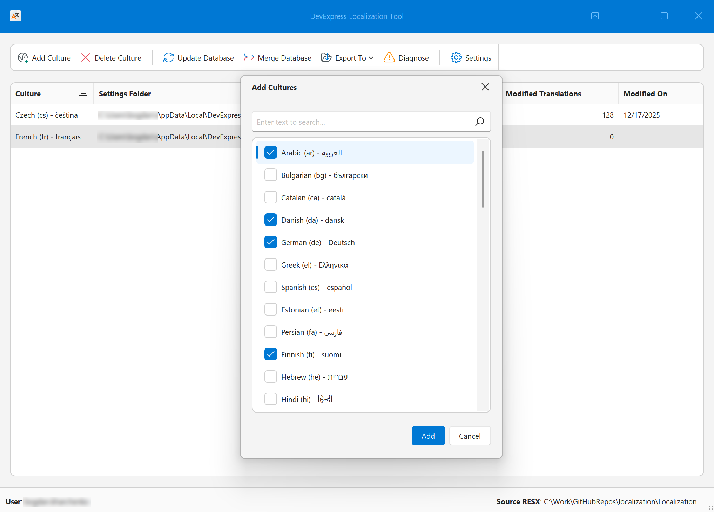
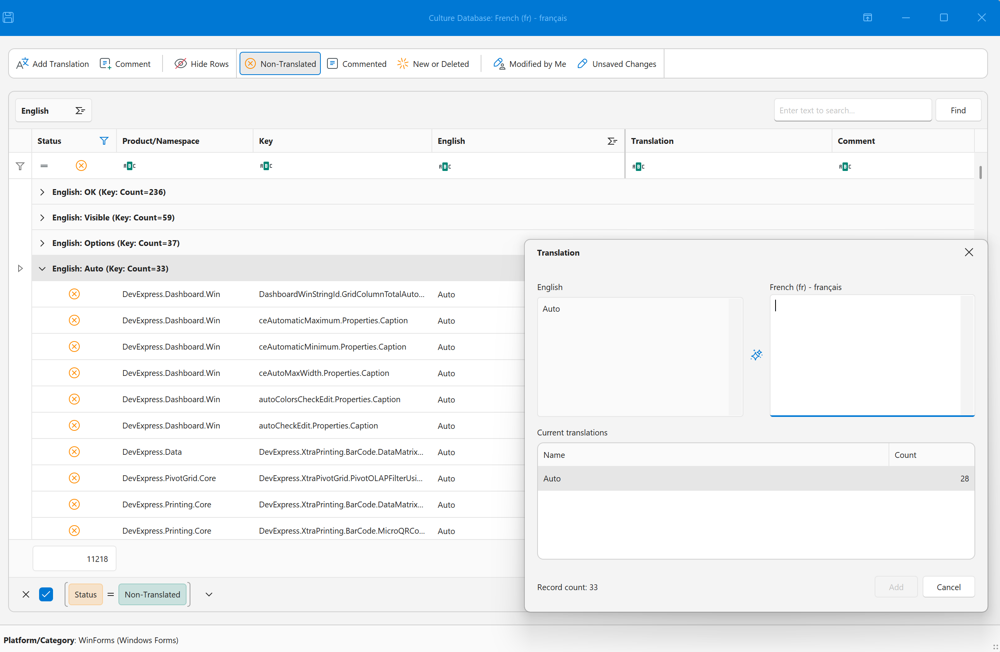

# DevExpress Localization Platform

The DevExpress Localization Platform is a new localization engine designed to simplify resource management, improve translation quality, and promote collaboration across teams and products.

This repo hosts all localization resources and tooling used by DevExpress product libraries.

> [Note]
> **Status**: Community Technology Preview (CTP)



## Features

- **Simpler localization management**
    
    Use advanced data shaping capabilities  to search, filter, group, and manage localization strings.
- **Enhanced translation consistency and coverage**
    
    Locate duplicate strings, find inconsistent translations using built-in validation, review context information, and run batch operations.
- **Multiple export formats**
    
    Export translations as:
        
    - Satellite assemblies
    - NuGet packages
    - A single merged RESX file for multiple products (replaces hundreds of assemblies)
    - JSON files for JavaScript/TypeScript-based products
- **Collaboration-first workflow**
    
    Track changes, review updates, import/ export resources, and rely on built-in backups. You can work directly with RESX files, use the DevExpress Windows-based tool, or build your own localization engine.
- **Multi-product and multi-platform support**
    
    Our current version supports WinForms, WPF, Blazor, ASP.NET Core, Reports, BI Dashboard, and XAF. Support for .NET MAUI, DevExtreme, and VCL UI Controls is planned.
- **AI-powered translation**
    
    Integrate your favorite AI service to automate and improve translation coverage directly within our Localization Platform.

## How it Works

Our Localization Platform loads DevExpress localization resources from the official GitHub repository or from user-selected products, assemblies, NuGet references, or project files. Users select the required DevExpress version, products, and target cultures to define localization scope.



For each culture, the tool creates and maintains a separate XML-based localization database. This database stores all translations, metadata, comments, validation states, and change history. The database supports version upgrades and reuse of translations between DevExpress releases.

```xml
<T>
  <Key>XtraSpreadsheetStringId.ConditionalFormattingRulesManagerForm_CaptionCancel</Key>
  <Path>DevExpress.Spreadsheet.Core\LocalizationRes.resx</Path>
  <English>Cancel</English>
  <German>Abbrechen</German>
  <Translation>Annuler</Translation>
  <PrevTranslation>Interrompre</PrevTranslation>
  <User>User_Name</User>
  <Date>20251218 11:48</Date>
</T>
```

Localization strings are presented in a powerful grid-based UI that supports instant search, filtering, grouping, and bulk operations. Users can translate large volumes of strings, apply consistent translations, review similar terms, add comments, and validate results using built-in quality checks, terminology rules, and optional AI-powered translation suggestions.



For collaborative scenarios, multiple contributors can work on the same language independently. Each contributor maintains his/her own culture database and later combines results using our built-in Merge feature. Validation detects conflicts, highlights differences, and helps resolve merge issues safely.

Once translations are complete, our platform generates ready-to-use localization output with a single action. Supported export formats include signed satellite assemblies, NuGet packages, RESX, and JSON. Export paths are generated automatically and can be customized in the settings, enabling a seamless, one-click localization workflows on Windows machines.

## Getting Started

Please refer to our online documentation for step-by-step guidance: [Getting Started — Localization Tool](https://docs.devexpress.com/GeneralInformation/404608).

## Feedback and Support

If you cannot run or use our Localization Platform, or if you have questions about supported functionality, please submit your questions via the [DevExpress Support Center](www.devexpress.com/ask) or the [GitHub Issues](https://github.com/DevExpress/localization/issues) tab. We are happy to help and appreciate your feedback.